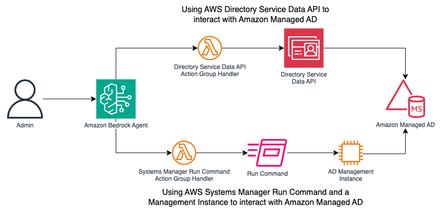

# Automate and troubleshoot AD using Amazon Bedrock Sample Code

This repository contains CDK sample code which deploys a fully working demo of
Amazon Bedrock Agents connecting to Microsoft Active Directory. You can use
Bedrock Agents to ask questions about your users in Active Directory, the
groups they belong to and compare how different users are configured.

To demonstrate the different methods of connecting Bedrock Agents to Active
Directory, it includes both an AWS Directory Service Data API implementation
of the action group handler and an AWS Systems Manager Run Command
implementation:



This sample is intended to be a demonstration of how Active Directory
administration can be supported using generative AI. It is not ready to be
directly deployed in a production environment.

## Usage

Before deploying the demo, you have to add access to the Anthropic Claude 3
Sonnet foundation model in Amazon Bedrock following
[these instructions](https://docs.aws.amazon.com/bedrock/latest/userguide/model-access-modify.html).

To deploy the demo, execute the following. It has been tested in the
**us-east-1** region and will take around 25 mins to deploy. A password for the
Admin user in the AWS Managed Microsoft AD directory will be generated and
stored in AWS Secrets Manager. IAM resources which grant permissions will be
created and we're skipping the stack level approvals through the
`--require-approval never` parameter:

```sh
npm install -g aws-cdk
cdk bootstrap
cdk deploy --all --require-approval never
```

To destroy the resources and clean up your environment:

```sh
cdk destroy --all
```

## Security

See [CONTRIBUTING](CONTRIBUTING.md#security-issue-notifications) for more information.

## License

This library is licensed under the MIT-0 License. See the LICENSE file.
